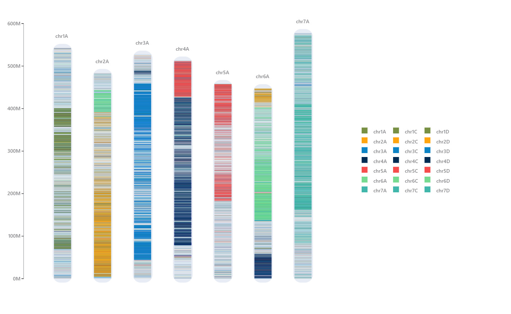

# oligo短探针可视化
##### 🙈: yukaiquan
##### 📧: 1962568272@qq.com
## 1 建立索引
`makeblastdb -in CD.insularis.fasta -dbtype nucl -parse_seqids`
`makeblastdb -in A.longiglumis.fasta -dbtype nucl -parse_seqids`
`makeblastdb -in A_atlantica_bmc_genome.fasta -dbtype nucl -parse_seqids`
## 2 比对分析
`nohup blastn -db /mnt/disk3/new_genome/CD/CD.insularis.fasta -task blastn-short -query prob_all.fasta -outfmt 6 -out CD_probe_out.txt -num_threads 16 &`

`nohup blastn -db /mnt/disk3/new_genome/A/A.longiglumis.fasta -task blastn-short -query prob_all.fasta -outfmt 6 -out lon_probe_out.txt -num_threads 16 &`

`nohup blastn -db /mnt/disk3/new_genome/A/A_atlantica_bmc_genome.fasta -task blastn-short -query prob_all.fasta -outfmt 6 -out ath_probe_out.txt -num_threads 16 &`

## 3 生成可视化需要的文件
### 3.1 生成blastn的比对结果
`awk -v FS='\t' -v OFS=',' 'BEGIN {print "source,chr,start,end"}$11<=1e-5 && $2!~/chrUn/{printf("%s,%s,%s,%s\n",$1,$2,$9,$10)}' lon_probe_out.txt > probe_lon.csv`

`awk -v FS='\t' -v OFS=',' 'BEGIN {print "source,chr,start,end"}$11<=1e-5 && $2!~/chrUn/{printf("%s,%s,%s,%s\n",$1,$2,$9,$10)}' CD_probe_out.txt > probe_cdins.csv`

`awk -v FS='\t' -v OFS=',' 'BEGIN {print "source,chr,start,end"}$11<=1e-5 && $2!~/chrUn/{printf("%s,%s,%s,%s\n",$1,$2,$9,$10)}' ath_probe_out.txt > probe_ath.csv`

### 3.2 生成染色体长度文件
`awk -v FS='\t' -v OFS=',' 'BEGIN {print "id,chr,length"}$1!~/chrUn/{printf("%s,%s,%s\n",NR,$1,$2)}' A.longiglumis.fasta.gz.fai > scau_lon.lenth.csv`
这样：
> id,chr,length
> 1,chr1A,612553975
> 2,chr2A,498282943
> 3,chr3A,546210969
> 4,chr4A,510052274
> 5,chr5A,477798686
> 6,chr6A,492989986
> 7,chr7A,570943435

`awk -v FS='\t' -v OFS=',' 'BEGIN {print "id,chr,length"}$1!~/chrUn/{printf("%s,%s,%s\n",NR,$1,$2)}' CD.insularis.fasta.fai > scau_ins_length.csv`

`awk -v FS='\t' -v OFS=',' 'BEGIN {print "id,chr,length"}$1!~/chrUn/{printf("%s,%s,%s\n",NR,$1,$2)}' A_atlantica_bmc_genome.fasta.fai > /public/workspace/kqyu/chorus2/09_bmc_ath/bmc_ath.lenth.csv`

## 4 可视化
可视化用的是javascript直接给项目地址吧

